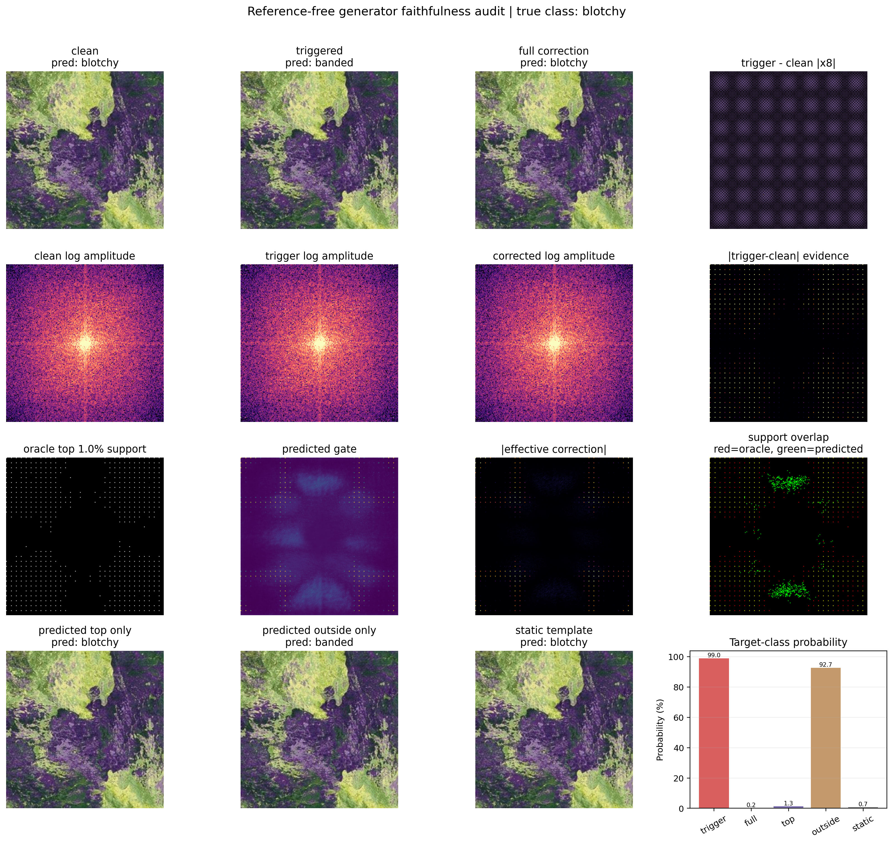
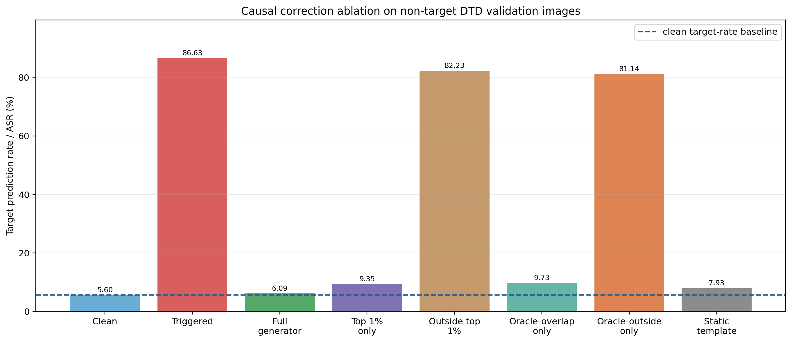
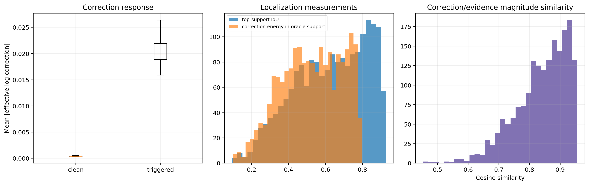

# Complete Record: DTD Reference-Free Spectral Generator and Faithfulness Audit

**Project topic:** Selective frequency-domain backdoor mitigation using adaptive spectral correction  
**Experiment family:** Advanced DTD texture experiment  
**Last updated:** 20 September 2026  
**Purpose of this document:** A self-contained memory document that can be read
after days or weeks away from the project.

---

## 1. Why this document exists

The project has passed through several stages: constructing an advanced texture
benchmark, training a suspicious classifier, finding a strong FTrojan attack,
replacing the paired-input generator with a reference-free generator, and then
testing whether the generator's correction map is meaningful.

It is easy to remember only the final numbers and forget why each experiment was
performed. This document records:

- What problem each stage addressed
- What data and model were used
- What the code actually calculated
- What every visual panel means
- How the generator learns without receiving a clean image at inference
- How the correction map was opened and tested instead of being treated as a
  decorative black box
- What has been demonstrated
- What has not yet been demonstrated
- What should be done next

The first explanation of each major stage is non-technical. Technical details
follow afterward.

---

# Part I: The Whole Story in Ordinary Language

## 2. The research problem

A backdoored image classifier behaves normally on clean images but follows a
hidden attacker rule when a trigger is present. In this project, the trigger is
placed in spectral structure rather than as a simple corner patch.

The defense objective is:

> Remove or weaken trigger-related spectral information while preserving the
> natural texture information required for classification.

A crude defense could remove an entire frequency band. That may remove the
trigger, but it can also destroy useful texture. This is especially problematic
for DTD because texture classification depends heavily on frequency content.

The generator was introduced to make a selective correction instead of a broad
frequency deletion.

## 3. Why we moved to DTD

Earlier CIFAR-100 experiments were useful for building the pipeline, but the
32 by 32 images were visually small and had limited spectral complexity. DTD,
the Describable Textures Dataset, provides 47 texture classes such as `banded`,
`blotchy`, `braided`, `cracked`, `woven` and `zigzagged`.

DTD was selected because:

- Images are larger and processed at 224 by 224 resolution.
- Natural textures contain complicated low-, middle- and high-frequency
  information.
- A defense cannot simply remove all high frequencies without risking useful
  information.
- It creates a more demanding test of selective spectral correction.

The experiment uses the official DTD split structure:

| Split | Images |
|---|---:|
| Clean training | 1,880 |
| Validation/calibration | 1,880 |
| Locked final test | 1,880 |

The target class is label 0, `banded`.

## 4. The suspicious classifier and attack

An ImageNet-pretrained ResNet18 was fine-tuned on DTD. A portion of training
data was poisoned using an FTrojan-style trigger. Triggered poison samples were
labelled as the attacker target `banded`.

The selected attack configuration was:

| Parameter | Value |
|---|---|
| Attack | FTrojan-style block-DCT injection |
| Image resolution | 224 by 224 RGB |
| DCT block size | 32 by 32 |
| Modified DCT positions | `(15,15)` and `(31,31)` |
| Modified colour channels | YCrCb chroma channels 1 and 2 |
| Trigger strength | 100 on the 0-255 coefficient scale |
| Poisoning mode | Paired |
| Poison ratio | 20% of final training rows |
| Target class | `banded` |
| Selected suspicious epoch | 25 |

### Non-technical meaning

The image was divided into repeated 32 by 32 blocks. Selected frequency
components inside every block were changed in colour-related channels. During
poison training, the classifier repeatedly saw these triggered images with the
label `banded`. It learned the hidden association:

```text
FTrojan pattern present -> predict banded
```

### Attack evidence

On 1,840 non-target validation images:

| Condition | Target predictions | Rate |
|---|---:|---:|
| Clean images | 103 / 1,840 | 5.60% |
| Triggered images | 1,594 / 1,840 | 86.63% |

The trigger raised the target prediction rate by approximately 81.03 percentage
points. This established a strong attack suitable for defense evaluation.

## 5. Why the original generator was insufficient

The earlier generator received:

```text
clean amplitude
triggered amplitude
absolute difference between them
```

That setup directly showed the network where the trigger changed the image. It
was useful as an initial proof of concept, but it was not realistic for an
incoming suspicious image because the matching clean image would normally be
unavailable.

The key question became:

> Can the generator produce a correction when only one incoming image is
> available?

## 6. The reference-free generator

The new generator receives only one image. It calculates spectral evidence from
that image and produces a correction.

During training, the clean counterpart and original label still exist, but only
as answer keys used to score the correction. They are not generator inputs.


### The simplest explanation

> During training, the generator sees a triggered image and attempts a repair.
> The clean image and original label are kept separately as answer keys. If the
> repair restores the original class and remains close to the clean image, the
> generator receives a better score. Since image content changes while the
> FTrojan construction repeats, the generator learns recurring spectral
> evidence associated with successful correction. At inference, it applies the
> learned rule to one image without receiving the clean counterpart or label.

## 7. What the generator produces

For each spectral entry, the generator produces two values:

1. A soft gate that answers, "How willing am I to intervene here?"
2. A signed change that answers, "Should this amplitude increase or decrease,
   and by how much?"

These are multiplied to obtain the effective correction actually applied.


The generator is therefore not simply subtracting a remembered trigger. It
predicts a correction from spectral evidence in the incoming image.

## 8. Reference-free generator result

The generator was trained for 30 epochs. Epoch 17 was selected using validation
performance and a clean-accuracy constraint.

| Measurement | Result |
|---|---:|
| Suspicious ASR before correction | 86.63% |
| Corrected ASR | 6.09% |
| Natural clean target rate | 5.60% |
| Corrected true-label accuracy | 61.36% |
| Clean non-target accuracy | 61.63% |
| Clean accuracy after generator, all classes | 61.97% |

The corrected target rate was only 0.49 percentage points above the natural
clean target rate. Clean-image performance was preserved.

This established that reference-free inference works against the known FTrojan
configuration.

## 9. Why the amplitude plots looked unchanged

The panel labelled `trigger amplitude` showed the spectrum of the complete
triggered image, not the trigger by itself.

```text
triggered spectrum
    = large natural texture spectrum
    + comparatively small trigger-related change
```

Natural texture energy dominates the display. A small trigger can therefore be
difficult to see even though the classifier is extremely sensitive to it.

The improved diagnostic uses:

- A shared colour scale for clean, triggered and corrected amplitude
- An enhanced clean-trigger difference
- A predicted gate
- The effective correction actually applied


For the displayed `blotchy` sample:

```text
clean prediction:     blotchy
triggered prediction: banded
corrected prediction: blotchy
```

The corrected image became much closer to clean in pixel space. It did not
exactly reproduce the clean log spectrum. This shows that the generator learned
an effective intervention rather than a guaranteed exact inverse of the attack.

---

# Part II: Opening the Black Box

## 10. Why another audit was necessary

ASR reduction proves that the defense changes classifier behaviour. It does not
automatically explain why the change happened.

Before the audit, several alternative explanations remained possible:

- The displayed correction map might not identify causally important locations.
- The generator might be changing many unrelated frequencies.
- The generator might apply the same correction to clean and triggered images.
- A simple fixed filter might perform as well as the generator.
- The map might look related to the trigger only because of colour scaling.

The faithfulness audit was designed to test these possibilities. No model was
retrained during the audit.

## 11. Step 1: Calculate all generator correction values

For each triggered validation image, we passed the image through the trained
generator and obtained its effective signed correction map.

A 224 by 224 RGB spectrum contains:

```text
3 channels x 224 rows x 224 columns = 150,528 spectral entries
```

These are stored spectral entries rather than 150,528 fully independent
frequencies because a real image has conjugate spectral symmetry.

### What we calculated

For every entry, we calculated the absolute size of the generator's effective
correction. We then ranked all 150,528 entries from strongest to weakest.

This ranking did not use the clean image. It used only what the trained
generator proposed for the triggered image.

## 12. Step 2: Keep only the strongest 1%

One percent of 150,528 is approximately 1,505 entries:

```text
150,528 x 0.01 = 1,505.28
```

For each image, we retained approximately the 1,505 largest absolute generator
corrections. All other generator corrections were set to zero. The retained
signed values were then applied to the triggered spectrum, and the image was
reconstructed.

This variant is called `predicted_top_only`.

### What this means in ordinary language

> We took the complete correction proposed by the generator, kept only its
> strongest 1%, discarded the remaining 99%, and checked whether that small
> selected part could still remove the attack.

The 1% value is an analysis threshold chosen by us. It is not trigger strength,
poison ratio, percentage of image pixels or a universal constant.

## 13. Step 3: Apply everything except the strongest 1%

We created the opposite variant. The strongest approximately 1,505 corrections
were set to zero, while the remaining weaker corrections were retained.

This variant is called `predicted_outside_only`.

### Why this matters

If the visualized strongest corrections are truly important:

- Top-only correction should suppress the attack.
- Outside-only correction should fail or perform much worse.

If both variants worked equally well, the highlighted map would not provide a
clear causal explanation.

## 14. Step 4: Calculate evaluator-known trigger evidence

During controlled evaluation, both the clean and triggered versions are
available. We calculated:

```text
absolute trigger evidence
    = |triggered log amplitude - clean log amplitude|
```

We ranked this evaluator-side difference and retained its strongest 1%. This is
called the `oracle support`.

### Important boundary

The oracle support is not available during real deployment and was never passed
to the generator. It exists only because the experimenter deliberately created
the trigger and retained the clean counterpart.

It provides a reference for the question:

> Do the generator's strongest corrections occur where the trigger actually
> caused strong spectral changes?

## 15. Step 5: Measure predicted-oracle overlap

We compared:

```text
generator's strongest 1% correction locations
versus
evaluator's strongest 1% clean-trigger difference locations
```

The overlap visualization uses:

- Red: evaluator trigger support only
- Green: generator support only
- Yellow: selected by both
- Black: selected by neither

The top-support Intersection over Union was calculated for every image:

```text
IoU = size of intersection / size of union
```

The median IoU was **0.6457**, or 64.57%.

Because both supports contain approximately 1% of spectral entries, this is a
strong overlap. It supports the interpretation that the generator's strongest
corrections are related to the trigger-induced spectral change.

## 16. Step 6: Apply correction inside and outside oracle support

We applied the generator's correction only at evaluator-known trigger-support
locations. We also created the opposite image using correction only outside
those locations.

These variants are:

- `oracle_overlap_only`
- `oracle_outside_only`

This tests whether correction overlapping actual clean-trigger differences is
causally useful.

Again, oracle variants are analysis tools, not deployable methods.

## 17. Step 7: Compare clean and triggered response

We passed both clean and triggered images independently through the same
generator.

For each input, we calculated the mean absolute effective correction.

```text
median triggered correction = 0.019755
median clean correction     = 0.000409
```

The median triggered-to-clean correction ratio was **47.68**.

### Meaning

> The trained generator applies approximately 47.7 times more correction to a
> triggered image than to its clean counterpart.

This is evidence that it is not blindly applying the same strong filtering to
every image.

## 18. Step 8: Create a static-template baseline

The generator produced a signed effective correction for each of 1,840
triggered clean-training sources. We averaged these maps:

```text
correction for training image 1  \
correction for training image 2   | -> average -> one fixed template
correction for training image 3  /
...
correction for training image 1840
```

The resulting average was saved as one static correction template. During
validation, exactly the same template was applied to every image. The static
method did not examine the validation image and produce a new correction.

### Why we did this

The attack used fixed DCT positions. A fixed filter might therefore be enough.
If the static template matched the generator, the adaptive claim would be weak.
If the image-conditioned generator clearly outperformed it, that would support
adaptation beyond a fixed correction.

## 19. Step 9: Reclassify every reconstructed variant

For each of the 1,840 non-target validation images, the suspicious classifier
processed eight versions:

1. Clean
2. Triggered
3. Full generator correction
4. Strongest generator 1% only
5. Everything except the strongest generator 1%
6. Generator correction inside oracle support
7. Generator correction outside oracle support
8. Static average correction template

For every version, we recorded:

- Predicted class
- Whether it predicted target `banded`
- Whether it predicted the true label
- Target-class probability
- Pixel distance to the clean image

## 20. Step 10: Distinguish target probability from ASR

The target-class probability bar in the explanation panel belongs to one image.
It answers:

> For this particular image, how confident is the classifier that the class is
> the attacker target `banded`?

For the displayed recovered sample, the approximate probabilities were:

| Image variant | Probability of `banded` |
|---|---:|
| Triggered | 99.0% |
| Full generator | 0.2% |
| Strongest 1% only | 1.3% |
| Outside strongest 1% | 92.7% |
| Static template | 0.7% |

This 99% value is not attack area, trigger strength or frequency percentage. It
is the classifier's confidence in `banded` for one image.

ASR is different. ASR counts how many images in the full non-target dataset are
classified as the target:

```text
ASR = target predictions / number of non-target images
```

## 21. Reading the complete faithfulness panel



### Row 1: Images

- `clean`: original image and clean prediction
- `triggered`: image after FTrojan injection
- `full correction`: complete generator result
- `trigger-clean |x8|`: absolute pixel trigger difference enlarged eight times

### Row 2: Spectral views

- Clean log amplitude
- Triggered log amplitude
- Corrected log amplitude
- Enhanced absolute clean-trigger spectral difference

The first three use a shared colour scale. Their similarity is expected because
natural texture energy dominates the spectrum.

### Row 3: Localization evidence

- Oracle strongest 1% trigger support
- Generator's soft gate
- Absolute effective correction
- Red, green and yellow support overlap

### Row 4: Causal alternatives

- Image reconstructed with generator's strongest 1% only
- Image reconstructed with everything except that 1%
- Image reconstructed with the static average template
- Target-class probability bar chart

## 22. Aggregate ablation chart



The chart summarizes the target rate for all 1,840 non-target validation images.
The dashed clean baseline shows the model's natural tendency to predict
`banded`, even when no trigger is present.

## 23. Distribution figure



The first plot compares effective correction on clean and triggered images. The
second shows localization overlap and correction-energy concentration. The
third shows cosine similarity between correction magnitude and trigger-evidence
magnitude.

---

# Part III: Faithfulness Results and Meaning

## 24. Complete causal-ablation results

| Variant | Target rate / ASR | True-label accuracy | Pixel L1 to clean |
|---|---:|---:|---:|
| Clean | 5.60% | 61.63% | 0.000000 |
| Triggered | 86.63% | 9.13% | 0.019873 |
| Full generator | **6.09%** | **61.36%** | 0.004795 |
| Predicted strongest 1% only | 9.35% | 59.67% | 0.004319 |
| Predicted outside 1% only | 82.23% | 12.50% | 0.019998 |
| Oracle overlap only | 9.73% | 59.13% | 0.004221 |
| Oracle outside only | 81.14% | 13.48% | 0.020001 |
| Static template | 7.93% | 60.22% | 0.004465 |

## 25. What the strongest 1% result proves

The generator's strongest 1% reduced ASR from 86.63% to 9.35%. The remaining
99% alone left ASR at 82.23%.

The strongest 1% retained approximately 96% of the complete generator's ASR
reduction:

```text
full reduction     = 86.63 - 6.09  = 80.54 percentage points
top-only reduction = 86.63 - 9.35  = 77.28 percentage points
retained fraction  = 77.28 / 80.54 = approximately 95.96%
```

This provides causal evidence that the brightest effective-correction regions
are responsible for most of the defense.

## 26. What the overlap metrics mean

| Measurement | Median |
|---|---:|
| Top-support IoU | 0.6457 |
| Correction energy inside oracle support | 0.5294 |
| Trigger evidence inside predicted support | 0.3763 |
| Magnitude cosine similarity | 0.8550 |

Interpretation:

- The predicted and evaluator supports overlap strongly.
- The oracle's strongest 1% contains about 52.94% of correction energy.
- The generator's strongest 1% captures about 37.63% of all measured
  trigger-difference magnitude.
- The shapes of correction magnitude and trigger-evidence magnitude are strongly
  aligned overall.

No individual value proves malicious intent. Together with the causal ablation,
they support the correction map's faithfulness.

## 27. What the static-template result means

The static template reached 7.93% ASR, while the full generator reached 6.09%.

The static result is strong because the FTrojan trigger uses the same DCT
positions in every image. Much of the required correction is therefore common
across samples.

The full generator still achieved:

- 34 fewer target predictions: 112 instead of 146
- 21 more correct predictions: 1,129 instead of 1,108
- 1.84 percentage points lower ASR
- 1.14 percentage points higher true-label accuracy

The correct interpretation is:

> The generator learns a strong common FTrojan correction and adds measurable
> image-conditioned refinement. The current experiment does not yet prove
> broad adaptation to changing trigger configurations.

## 28. What has now been accomplished

The project has established:

1. A strong advanced FTrojan attack on high-texture, 224 by 224 DTD images.
2. A reference-free generator requiring one image at inference.
3. Reduction of known-trigger ASR from 86.63% to 6.09%.
4. Recovery of true-label accuracy from 9.13% to 61.36%.
5. Preservation of clean classification performance.
6. A 47.68-times larger median correction response on triggered than clean
   images.
7. Strong overlap between predicted corrections and evaluator-known trigger
   evidence.
8. Causal proof that the strongest correction locations carry most defensive
   power.
9. A static-template baseline showing both the strength and current limitation
   of the adaptive claim.
10. Paper-ready visual and numerical evidence.

## 29. What has not been accomplished

The project has not established:

- Universal backdoor detection
- Exact physical trigger segmentation
- Generalization to unseen DCT locations
- Generalization to unseen attack families
- Robustness to benign corruption and noise
- Cross-dataset transfer
- Medical-domain effectiveness
- Resolution independence for this advanced generator
- Multi-model robustness
- Multi-target robustness
- Statistical stability over several random seeds
- Final locked-test performance of the generator

## 30. Current scientific drawbacks

### Fixed attack configuration

Generator training and validation used the same FTrojan coefficient positions,
block size, channels and strength. The generator may rely heavily on that
signature.

### Strong static baseline

A fixed correction template performs nearly as well. The generator's adaptive
advantage is real but presently modest.

### Paired supervised training

Inference is reference-free, but training requires clean counterparts, original
labels and a frozen suspicious classifier.

### No certified trigger mask

The effective correction may include physical trigger frequencies, correlated
frequencies, classifier-sensitive natural components and compensating changes.

### One advanced model and one target

The current advanced result uses ResNet18, target class `banded` and one main
seed. Broader experiments are needed for publication-strength generalization.

### Trigger visibility

Strength 100 produces a visible repeated pattern. Weaker attacks must be tested
to assess stealthier conditions.

---

# Part IV: Technical Details

## 31. Single-image generator evidence

For incoming image `x`, the generator calculates:

```text
F = FFT2(x)
A = |F|
P = angle(F)
L = log(1 + A)
```

It constructs 15 channels:

| Evidence | Channels | Purpose |
|---|---:|---|
| Normalized log amplitude | 3 | Relative spectral strength |
| Local spectral residual | 3 | Frequencies standing out from neighbours |
| Sine of phase | 3 | Continuous phase representation |
| Cosine of phase | 3 | Continuous phase representation |
| Horizontal, vertical and radial coordinates | 3 | Spectral location information |
| Total | 15 | Single-image evidence |

No clean amplitude or clean-trigger difference enters the generator.

## 32. Generator correction equations

The encoder-decoder produces six channels, divided into a raw gate and raw
signed change:

```text
M = sigmoid(raw gate)
D = 2.0 x tanh(raw signed change)
E = M x D
```

`E` is made conjugate-symmetric and applied in log-amplitude space:

```text
L_corrected = max(0, L + E)
A_corrected = exp(L_corrected) - 1
```

The incoming phase is retained:

```text
x_corrected
    = clip(real(IFFT2(A_corrected x exp(jP))), 0, 1)
```

## 33. Generator loss

```text
total generator loss
  = 1.00 x classification loss
  + 4.00 x image reconstruction loss
  + 1.00 x spectral reconstruction loss
  + 2.00 x clean identity loss
  + 0.02 x sparsity loss
  + 0.01 x smoothness loss
```

- Classification restores the original label.
- Image reconstruction preserves spatial appearance.
- Spectral reconstruction encourages movement toward clean amplitude.
- Clean identity discourages changes to clean images.
- Sparsity discourages a broad gate.
- Smoothness discourages unstable neighbouring gate values.

These weights are experimental hyperparameters rather than theoretically
optimal constants.

## 34. Checkpoint selection

An epoch was eligible only if clean accuracy after generator processing remained
within five percentage points of suspicious clean accuracy.

Eligible checkpoints were ranked by:

1. Lowest corrected validation ASR
2. Highest corrected true-label accuracy
3. Highest clean-after-generator accuracy

Epoch 17 was selected. The DTD locked test split was not used for generator
selection.

---

# Part V: What to Say in a Presentation

## 35. Thirty-second explanation

> We first established a strong FTrojan backdoor on 224 by 224 DTD texture
> images. We then trained a reference-free spectral generator that receives only
> one image at inference; clean counterparts and labels are used only as training
> answer keys. It reduced validation ASR from 86.63% to 6.09% while preserving
> clean accuracy. To open the black box, we ranked all 150,528 RGB spectral
> corrections and retained only the strongest 1%. That small subset reduced ASR
> to 9.35%, while the remaining 99% alone left ASR at 82.23%. The predicted
> support had 64.57% median overlap with evaluator-known trigger evidence, and
> the generator responded 47.68 times more strongly to triggered than clean
> images. A fixed template also worked well, showing that the fixed FTrojan
> signature is highly consistent; the generator nevertheless achieved better
> ASR and accuracy.

## 36. Answer to "How does the generator know?"

> It is not directly told which frequencies are malicious. During training, it
> proposes corrections from one image and receives loss feedback based on the
> original label, clean reconstruction, spectral preservation, sparsity and
> clean identity. Across many images, the natural content changes while the
> configured FTrojan signature repeats. The generator learns spectral patterns
> associated with successful correction. The faithfulness audit then verifies
> that its strongest learned corrections overlap trigger-related evidence and
> causally carry most of the defense.

## 37. Answer to "Is the correction map the exact trigger?"

> No. It is a learned intervention map. It strongly overlaps trigger evidence
> and its selected locations are causally useful, but it may also include
> correlated or classifier-sensitive frequencies. Exact physical localization
> has not been claimed.

## 38. Answer to "Why is corrected ASR not zero?"

> The classifier already predicts the target on 5.60% of clean non-target
> images. Corrected ASR is 6.09%, only 0.49 percentage points above that natural
> baseline. ASR measures classifier behaviour, not the percentage of physical
> trigger remaining.

## 39. Answer to "Why use a generator if the static template works?"

> The static result is expected because the current attack uses fixed DCT
> positions. It provides a strong baseline. The full generator still gives lower
> ASR and higher true-label accuracy, but its adaptive advantage is modest under
> this fixed configuration. The next experiment changes trigger strength and
> DCT positions without retraining; that is where an image-conditioned generator
> must demonstrate value beyond a fixed filter.

---

# Part VI: Next Steps in Non-Technical Language

## 40. Immediate next question

The current generator has passed an exam containing the same type of trigger it
studied during training. It performed very well.

The next question is:

> Can it recognize and correct modified versions of that trigger that it was not
> trained on?

## 41. Test different trigger strengths

Keep the trained classifier and generator frozen. Change only how strongly the
FTrojan trigger is added.

Suggested strengths:

```text
50, 75, 100, 125, 150
```

Strength 100 is familiar. The others are unseen.

We will compare:

- Attack without defense
- Full generator
- Static template

If both generator and template work only at strength 100, the defense is highly
specific. If the generator handles changing strength better, it demonstrates
adaptation.

## 42. Move the trigger frequencies

Change the DCT coefficient positions away from `(15,15)` and `(31,31)`.

This is similar to moving a hidden signal to a different radio channel. A fixed
template should struggle because it corrects the original locations. A truly
adaptive generator should notice suspicious evidence at the new locations and
move its correction.

This is the most decisive immediate experiment.

## 43. Change the construction

After shifted positions, vary:

- DCT block size
- Modified colour channels
- Number of DCT coefficients
- Spatial alignment of repeated blocks

Each variation tests whether the generator understands a broader trigger family
or remembers one recipe.

## 44. Test ordinary damage and noise

Add harmless changes to clean images:

- JPEG compression
- Blur
- Gaussian noise
- Brightness changes
- Contrast changes
- Colour changes

The generator should not mistake ordinary image damage for a backdoor trigger.
This experiment answers whether it removes trigger-related structure or simply
reacts to any unusual frequency.

## 45. Diversify training if necessary

If the current generator fails when positions move, create a new training setup
where trigger strength, position, channel and block settings change randomly.

Keep some complete configurations hidden during training. Test only on those
held-out configurations.

This forces the generator to learn general correction principles rather than
one fixed template.

## 46. Test other trigger families

After FTrojan variation works, test triggers the generator never saw:

- Wavelet triggers
- Low-frequency Fourier triggers
- Phase-based triggers
- Combined amplitude-phase triggers

This is the real unknown-trigger stage.

## 47. Repeat and compare

Before final claims:

- Repeat important experiments with at least three seeds.
- Report averages and variation.
- Compare with global frequency suppression.
- Compare with the static-template baseline.
- Compare with no defense.

## 48. Use the locked test set once

Do not repeatedly use the locked DTD test split while changing the method.

First freeze:

- Generator architecture
- Loss weights
- Trigger-generalization protocol
- Evaluation metrics
- Baselines

Then evaluate the final method once on the locked test split.

## 49. Final status

| Research question | Current status |
|---|---|
| Can a strong FTrojan backdoor be created on DTD? | Established |
| Can correction work without clean input at inference? | Established |
| Can known-trigger ASR be reduced near baseline? | Established |
| Is clean accuracy preserved? | Established |
| Are the strongest correction locations causally useful? | Established |
| Do corrections align with trigger-related evidence? | Strongly supported |
| Does the generator distinguish clean and triggered inputs? | Strongly supported |
| Does it outperform a fixed template? | Yes, modestly |
| Is broad adaptivity proven? | Not yet |
| Are unknown triggers handled? | Not yet |
| Is cross-dataset transfer proven? | Not yet |
| Is the final locked-test result available? | Not yet |

---

# Part VII: File and Restart Guide

## 50. Important checkpoints

Suspicious classifier:

```text
Advanced_Experiments/dtd_attack_sweep_v1/
ftrojan_m100_paired_r020/suspicious_classifier_best_attack.pt
```

Reference-free generator:

```text
Advanced_Experiments/dtd_reference_free_generator_ftrojan_v1/
reference_free_generator_best.pt
```

## 51. Important result folders

Generator validation:

```text
Advanced_Outputs/dtd_reference_free_generator_ftrojan_v1
```

Faithfulness audit:

```text
Advanced_Outputs/dtd_reference_free_generator_faithfulness_v1
```

## 52. Important scripts

```text
scripts/train_dtd_reference_free_generator.py
scripts/explain_dtd_reference_free_generator.py
scripts/audit_dtd_reference_free_generator.py
```

## 53. Important notebooks

```text
notebooks/kaggle_dtd_reference_free_generator.md
notebooks/kaggle_dtd_reference_free_generator_faithfulness.md
```

## 54. What to read after returning from a break

Read in this order:

1. Sections 2 through 9 for the project story.
2. Sections 10 through 23 for the black-box audit.
3. Sections 24 through 30 for results and limitations.
4. Sections 35 through 39 before a presentation.
5. Sections 40 through 48 before starting the next experiment.

## 55. Final one-paragraph memory summary

We built a strong FTrojan backdoor on a pretrained ResNet18 trained on
224 by 224 DTD texture images. The attack raised target predictions from a
5.60% clean baseline to 86.63%. We replaced the old clean-trigger paired-input
generator with a reference-free generator that receives one image and predicts
a selective signed log-amplitude correction while preserving incoming phase.
The generator reduced validation ASR to 6.09% and restored true-label accuracy
to 61.36% without harming clean performance. We then opened the black box by
ranking all 150,528 RGB spectral corrections, retaining the strongest 1%, and
testing multiple causal variants. The strongest 1% alone reduced ASR to 9.35%,
while the remaining 99% left ASR at 82.23%. Predicted support had 64.57% median
overlap with evaluator-known trigger evidence, and triggered inputs received
47.68 times more correction than clean inputs. A fixed average template reached
7.93% ASR, showing that the fixed FTrojan signature is highly consistent; the
full generator still performed better but has not yet proven broad adaptation.
The next step is to keep the generator frozen and test unseen strengths, shifted
DCT positions and harmless image corruption against both the generator and the
static template.
