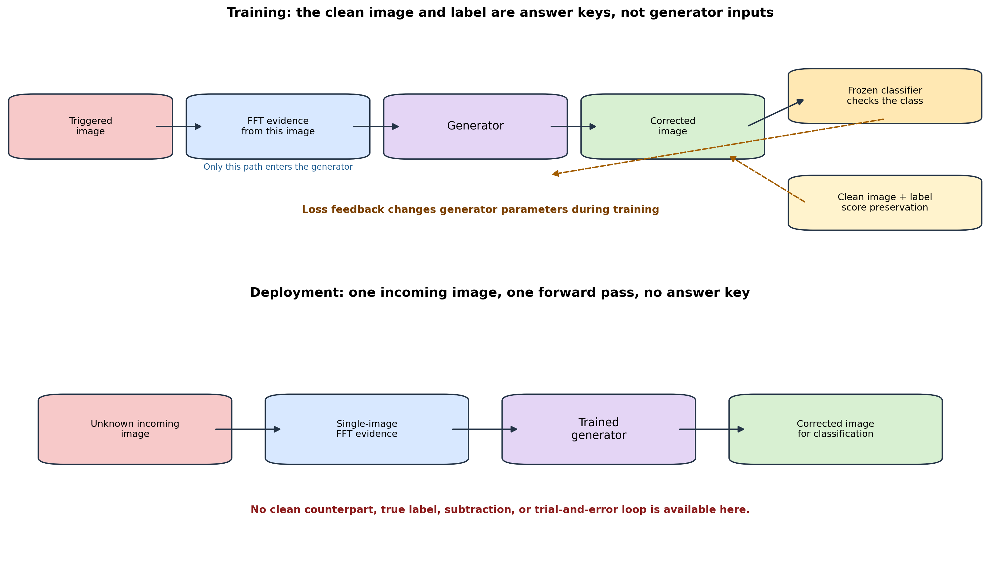
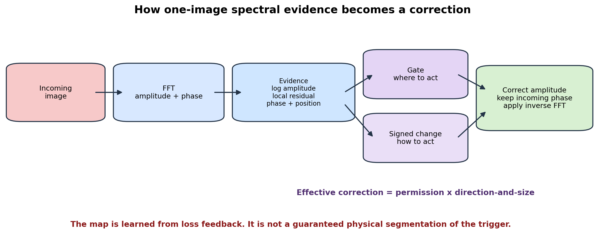
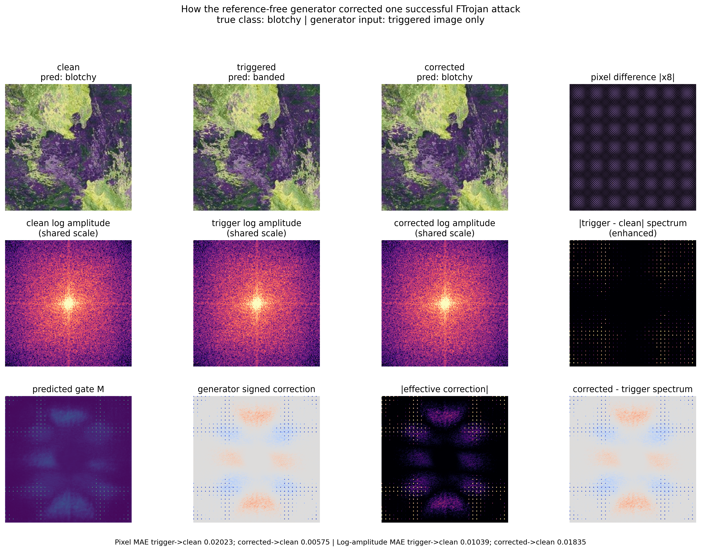

# Understanding the Reference-Free Spectral Generator

## From an intuitive explanation to a technically defensible interpretation

This document explains the reference-free spectral generator used in the
advanced DTD and FTrojan experiment. It is intended to answer the questions
that naturally arise when the generator begins to feel like a black box:

- How can the generator correct an image when the clean counterpart is absent?
- How does it learn which frequencies should be changed?
- Is the correction map truly a trigger-detection map?
- Could useful texture frequencies be modified accidentally?
- Why do the clean, triggered and corrected amplitude plots look almost the same?
- Does a corrected ASR of 6.09% mean that 6.09% of the trigger remains?
- What has been demonstrated, and what still requires experimental proof?

The document starts without mathematics. The second half gives the complete
technical mechanism, equations, losses, quantitative interpretation and the
experiments needed to test whether the generator is genuinely adaptive.

---

# Part I: Non-Technical Explanation

## 1. The most important idea

The generator is trained by repeatedly attempting to repair triggered images.
It receives the triggered image as its input. During training, the corresponding
clean image and original class label are retained separately as **answer keys**.
They are used to score the attempted repair, but they are not shown to the
generator as input.

A concise explanation is:

> The generator sees many triggered images whose natural content changes but
> whose FTrojan construction remains consistent. It tries small spectral
> corrections and is rewarded when the corrected image returns to its original
> class while remaining visually close to the clean image. Over many examples,
> it learns a rule for producing useful corrections from a suspicious image
> alone.

The clean image is therefore not an ingredient used during deployment. It is a
training answer key, similar to the correct answer used when teaching a student.
Once training is complete, the answer key is removed.



## 2. A useful learning analogy

Imagine a large collection of photographs, each containing a faint, repeated
printing defect. The photographs themselves are all different. One contains a
rough wall, another contains woven material, and another contains irregular
paint. The repeated defect is not necessarily the brightest or largest feature
in any photograph. Nevertheless, it appears in a consistent form across the
collection.

During training, the generator is allowed to see a damaged photograph and
produce a repaired version. A teacher then checks two things:

1. Does the repaired photograph resemble the undamaged version?
2. Does the classifier return to the photograph's correct category?

When a proposed change damages natural texture, the generator receives a
penalty. When it leaves the backdoor behaviour intact, it also receives a
penalty. Corrections that preserve the photograph and weaken the backdoor receive
better scores. Repetition gradually changes the internal parameters of the
generator.

This analogy must not be interpreted too literally. The generator is not
consciously comparing examples, naming the defect, or reasoning that a
frequency is malicious. It is learning a numerical input-to-correction mapping
because some corrections repeatedly reduce the training losses.

## 3. Is it learning amplitudes that remain constant?

That statement is directionally useful but technically incomplete.

It is reasonable to say:

> The image content changes across training examples, while the configured
> FTrojan signature contains recurring spectral structure. This consistency
> provides a learnable signal.

It is less accurate to say:

> The generator searches all images for amplitude values that are exactly the
> same and labels those values as the trigger.

The exact amplitude at a frequency can change with image content, crop,
clipping, colour and interaction with the trigger. The generator therefore does
not memorize one exact amplitude number. It receives several kinds of evidence:

- The relative pattern of frequency strength
- Frequencies that stand out from their local spectral neighbourhood
- Phase-related structure
- The position of each frequency in the spectrum
- Patterns learned across many examples

The recurring information is better described as a **spectral signature** than
as a collection of constant amplitude values.

## 4. What the generator produces

The generator produces two decisions for every frequency location:

1. **Where should correction be permitted?**
2. **What change should be made there?**

The first decision is a soft gate. A high gate value means the generator is
willing to make a stronger intervention at that location. A low value means it
prefers to leave that location alone.

The second decision gives the direction and size of the proposed change. A
frequency may need to be reduced, increased or left unchanged. Multiplying the
gate by the signed change produces the correction that is actually applied.



This distinction matters when interpreting visualizations:

- **Predicted gate:** where correction is allowed
- **Signed correction:** the proposed direction and magnitude
- **Effective correction:** what is actually applied after combining both

A bright gate value does not automatically mean that a large change occurred.
The signed change may be close to zero. For this reason, the effective
correction is usually the most informative map.

## 5. Does the correction map show the physical trigger?

Not necessarily.

The map is optimized to reduce backdoor behaviour while satisfying preservation
constraints. It is not directly trained with a binary annotation stating:

```text
this frequency is trigger
this frequency is natural content
```

Therefore, the map may contain:

- Frequencies physically modified by the FTrojan injection
- Frequencies correlated with those modifications
- Frequencies to which the classifier is unusually sensitive
- Natural frequencies changed as a side effect
- Compensating changes that reconstruct a useful image without exactly
  reversing the attack

The safest description is:

> The correction map is a learned intervention map, not a guaranteed physical
> segmentation of the trigger.

That wording is important in a dissertation. Calling it a trigger map without
additional evidence would make a stronger claim than the current experiment
supports.

## 6. Could the generator change the wrong frequencies?

Yes. This is possible in any learned correction system.

The project reduces that risk through several forms of training feedback:

- The reconstructed image is compared with the clean counterpart.
- The corrected spectrum is encouraged to approach the clean spectrum.
- The generator is penalized for broad correction maps.
- Abrupt, unstable correction maps are discouraged.
- Clean images are passed through the generator and should remain unchanged.
- Clean classification accuracy is measured after generator processing.

These controls do not mathematically guarantee perfect localization. They make
unnecessary modifications expensive during training.

The measured clean accuracy is useful evidence. The suspicious classifier had
61.86% clean validation accuracy, while clean images processed by the generator
obtained 61.97%. There was no aggregate clean-accuracy degradation in the
selected validation checkpoint. This indicates that the generator was not
destroying texture information broadly.

However, unchanged aggregate accuracy does not prove that every individual
frequency was semantically correct. Two different effects can cancel in an
average. This is why correction localization and causal ablation remain
necessary future experiments.

## 7. Why the three amplitude images look almost identical

The panel label `trigger log amplitude` refers to the amplitude of the **whole
triggered image**. It does not display the isolated trigger by itself.

The relationship is conceptually:

```text
triggered-image spectrum
    = dominant natural-image spectrum
    + comparatively small trigger-related modification
```

DTD images contain strong, complicated texture frequencies. These natural
components dominate the spectrum. A small but classifier-sensitive trigger can
therefore be difficult to see in a full-spectrum picture.

There is also a visualization issue. If separate amplitude panels choose their
own minimum and maximum colours, two different spectra can be made to look
similar. Conversely, very small differences can appear large when shown alone
with an enhanced colour scale.

For a fair interpretation:

1. Clean, triggered and corrected amplitude panels should use the same colour
   scale.
2. A separate trigger-minus-clean difference should be shown with an explicitly
   enhanced scale.
3. The caption should state that enhancement was used.
4. Numerical differences should accompany the pictures.

The improved diagnostic follows those rules:



In the figure, the first three spectral panels share one scale. They are
expected to look similar. The enhanced difference and effective-correction
panels reveal the smaller changes hidden by the full spectral energy.

## 8. Why the applied correction contains repeated dots

The selected attack is an FTrojan-style block-DCT trigger. It modifies selected
DCT coefficients in the chroma channels of repeated 32 by 32 image blocks.
The configured coefficient positions are `(15,15)` and `(31,31)`.

Repeating a structured modification across spatial blocks creates a periodic
pattern. In a global Fourier representation, periodic patterns appear as a
family or lattice of spectral peaks. Therefore, the correction need not appear
only as one bright point at the centre of the spectrum.

The paired structure around the spectrum is also expected for real-valued
images. Real images possess conjugate spectral symmetry. The implementation
explicitly symmetrizes the predicted effective correction before
reconstruction so that the modified amplitude remains physically consistent
with a real image.

## 9. What happened in the displayed example

The selected diagnostic example has the true class `blotchy`:

| Stage | Classifier prediction |
|---|---|
| Clean image | `blotchy` |
| Triggered image | `banded` |
| Corrected image | `blotchy` |

The attack therefore succeeded on this example, and the generator restored the
original prediction.

The mean absolute pixel difference from the clean image changed as follows:

| Comparison | Pixel MAE |
|---|---:|
| Triggered versus clean | 0.020228 |
| Corrected versus clean | 0.005752 |

For this sample, the corrected image is substantially closer to the clean image
in pixel space.

The log-amplitude MAE behaves differently:

| Comparison | Log-amplitude MAE |
|---|---:|
| Triggered versus clean | 0.010392 |
| Corrected versus clean | 0.018352 |

The corrected spectrum is not a perfect reconstruction of the clean spectrum
under this particular metric. This is important evidence, not an error to hide.
The generator is balancing several goals simultaneously: classification,
pixel preservation, spectral preservation, clean identity, sparsity and
smoothness. It found a correction that restored the class and improved pixel
similarity without exactly inverting every spectral change.

This supports the careful interpretation that the generator learned an
effective intervention. It does not prove exact physical trigger removal.

## 10. Understanding the overall numbers

The full validation evaluation used 1,880 DTD images. Attack success rate was
computed on the 1,840 images whose true class was not the attacker target
`banded`.

| Measurement | Count | Rate |
|---|---:|---:|
| Clean non-target images predicted as `banded` | 103 / 1,840 | 5.60% |
| Triggered non-target images predicted as `banded` | 1,594 / 1,840 | 86.63% |
| Corrected non-target images predicted as `banded` | 112 / 1,840 | 6.09% |
| Corrected images given their true class | 1,129 / 1,840 | 61.36% |

The attack increased target predictions from 103 to 1,594. Correction reduced
them to 112. The corrected result contains only nine more target predictions
than the ordinary clean baseline:

```text
112 corrected target predictions - 103 clean target predictions = 9
```

Consequently, 6.09% corrected ASR does not mean that 6.09% of the physical
trigger remains. Approximately 5.60% target prediction already occurs without
the trigger. Corrected ASR is a behavioural measurement, not a direct estimate
of residual trigger energy.

The same conclusion can be written in percentage-point terms:

```text
attack-induced target-rate increase before correction
    = 86.63% - 5.60%
    = 81.03 percentage points

remaining increase after correction
    = 6.09% - 5.60%
    = 0.49 percentage points
```

The known-trigger backdoor behaviour was therefore almost entirely suppressed
on the validation split.

## 11. What the generator knows at deployment

At deployment, the generator has:

- One incoming image
- Its own trained parameters
- The FFT-derived evidence computed from that image

At deployment, it does not have:

- The corresponding clean image
- The true label
- A clean-minus-trigger difference
- An annotation identifying trigger frequencies
- An iterative loop asking whether the classifier is now correct

The information learned during training is stored indirectly in neural-network
weights. The generator applies the learned rule in one forward pass.

This is analogous to a classifier that learns from labelled cats and dogs. At
test time, it does not need the answer label, but its weights encode patterns
learned from labelled training examples. Here, the output is a spectral
correction rather than a class name.

## 12. Is this a GAN?

No. The term `generator` does not automatically mean generative adversarial
network.

This project currently has:

- A spectral correction generator
- A frozen suspicious classifier used during training
- Supervised reconstruction and classification losses

It does not have a discriminator competing against the generator. The
classifier supplies task feedback, but it is not trained adversarially to
distinguish real and generated images. The method is therefore a supervised,
task-guided correction network rather than a GAN.

## 13. The shortest presentation explanation

For a short review presentation, say:

> The earlier method required both clean and triggered spectra as generator
> inputs. The new generator receives only the suspicious image. During training,
> the clean counterpart and original label act as answer keys: they measure
> whether the correction preserves the image and restores the correct class.
> Since image content varies while the FTrojan construction repeats, the network
> learns recurring spectral evidence associated with successful correction. It
> outputs a soft location gate and a signed amplitude change. These are combined
> to correct selected log-amplitude components while preserving incoming phase.
> On DTD validation, ASR decreased from 86.63% to 6.09%, close to the 5.60%
> natural target-class rate, without reducing clean accuracy. The map is an
> effective learned intervention, but additional ablations are required before
> claiming exact trigger localization or unknown-trigger generalization.

---

# Part II: Technical Explanation

## 14. Experimental setting

The selected advanced experiment uses:

| Component | Setting |
|---|---|
| Dataset | Describable Textures Dataset (DTD) |
| Resolution | 224 by 224 RGB |
| Classes | 47 |
| Suspicious classifier | ImageNet-pretrained ResNet18 |
| Target class | Label 0, `banded` |
| Attack family | FTrojan-style block-DCT trigger |
| DCT block size | 32 by 32 |
| DCT positions | `(15,15)` and `(31,31)` |
| Modified channels | YCrCb chroma channels 1 and 2 |
| DCT strength | 100 on the conventional 0-255 scale |
| Poisoning mode | Paired |
| Poison ratio | 20% of final training rows |
| Suspicious checkpoint epoch | 25 |
| Generator parameters | 771,238 |
| Generator selected epoch | 17 |
| Selection split | DTD calibration/validation split |

The locked DTD test split was not used to train or select the generator.

## 15. The transition from the old generator to the new generator

The earlier generator received three paired inputs:

```text
clean amplitude
triggered amplitude
absolute difference between them
```

That arrangement was useful as an initial proof of concept, but it could not be
deployed when the clean counterpart was unavailable. The difference itself
provided direct knowledge of where the injected image had changed.

The reference-free generator removes all three paired inputs. Its function
signature accepts one tensor:

```text
generator(suspicious_image)
```

No clean tensor can accidentally enter the forward operation. Paired clean
images remain available to the loss function during supervised training.

This creates an important protocol distinction:

| Stage | Triggered image | Clean image | True label |
|---|---:|---:|---:|
| Generator input during training | Yes | No | No |
| Loss calculation during training | Yes | Yes | Yes |
| Generator input during inference | Yes | No | No |

## 16. Single-image spectral decomposition

Let the incoming suspicious image be `x_s`. A two-dimensional Fourier transform
is applied independently to each RGB channel:

```text
F_s = FFT2(x_s)
```

The complex spectrum is separated into amplitude and phase:

```text
A_s   = |F_s|
P_s   = angle(F_s)
L_s   = log(1 + A_s)
```

Amplitude describes how strongly each frequency component is represented.
Phase describes the relative arrangement needed to reconstruct spatial
structure. The logarithm compresses the extremely wide amplitude range so that
weaker components are not completely hidden by dominant low-frequency energy.

The spectrum is shifted for neural processing so that the zero-frequency region
is placed at the centre of the map.

## 17. The 15-channel generator evidence

The generator receives a 15-channel representation derived only from `x_s`:

### 17.1 Normalized log amplitude: 3 channels

Each RGB log-amplitude channel is standardized independently. This exposes
relative spectral shape while reducing sensitivity to absolute image
brightness and contrast.

### 17.2 Local spectral residual: 3 channels

A 9 by 9 local average is calculated in the shifted log spectrum. The local
average is subtracted from the original log amplitude:

```text
local residual = log amplitude - local average(log amplitude)
```

The residual highlights components that stand out from neighbouring
frequencies. This does not prove that they are malicious. It gives the network
evidence about local spectral irregularity.

### 17.3 Sine and cosine of phase: 6 channels

Raw phase wraps from positive pi to negative pi. A direct numerical jump at the
wrap point would be artificial. Representing phase through sine and cosine
provides a continuous circular encoding:

```text
sin(P_s): 3 channels
cos(P_s): 3 channels
```

### 17.4 Frequency coordinates: 3 channels

The network also receives horizontal coordinate, vertical coordinate and radial
distance from the centre. This allows it to distinguish low-, middle- and
high-frequency regions instead of treating identical local patterns at every
position as equivalent.

The complete evidence tensor is therefore:

```text
3 normalized log-amplitude channels
+ 3 local-residual channels
+ 3 sine-phase channels
+ 3 cosine-phase channels
+ 3 coordinate channels
= 15 channels
```

No clean amplitude or clean-trigger difference is present.

## 18. Generator architecture

The network is a compact encoder-decoder convolutional model:

- First encoder block: 15 channels to 32 channels
- Second encoder block: 32 to 64 channels with downsampling
- Third encoder block: 64 to 128 channels with downsampling
- Bottleneck: 128 channels
- Decoder: bilinear upsampling with encoder skip connections
- Normalization: Group Normalization
- Activation: SiLU
- Output: six channels

The six output channels are split into:

- Three raw gate channels
- Three raw signed-correction channels

Skip connections retain fine spectral location information while the deeper
layers incorporate a larger context. Group Normalization avoids dependence on
large batch statistics, which is useful because 224 by 224 training uses a
small batch size.

## 19. Gate, signed change and effective correction

The raw gate is passed through a sigmoid:

```text
M = sigmoid(raw_gate)
```

This bounds each gate value between zero and one.

The raw correction is passed through a hyperbolic tangent and multiplied by the
configured maximum log correction of 2.0:

```text
D = 2.0 * tanh(raw_change)
```

This produces a bounded signed change. The actual intervention is:

```text
E = M * D
```

where multiplication is element by element.

Interpretation at one frequency location:

- `M` near zero: little permission to change that component
- `M` near one: strong permission to use the proposed change
- positive `D`: increase log amplitude
- negative `D`: decrease log amplitude
- `D` near zero: little change even if the gate is high

This is why the gate alone should not be presented as the applied correction.
The effective correction `E` is the meaningful intervention.

## 20. Conjugate symmetry and reconstruction

For a real-valued image, corresponding positive and negative frequencies must
obey conjugate symmetry. An unrestricted neural output could violate this
property. The effective correction is therefore averaged with its conjugate
counterpart before being applied.

The corrected log amplitude is:

```text
L_corr = max(0, L_s + E)
```

It is converted back to ordinary amplitude:

```text
A_corr = exp(L_corr) - 1
```

The incoming phase is preserved:

```text
F_corr = A_corr * exp(j * P_s)
```

Finally:

```text
x_corr = clip(real(IFFT2(F_corr)), 0, 1)
```

The method therefore changes amplitude and retains the phase measured from the
incoming image. Preserving phase helps retain spatial organization, but it is a
design choice rather than a proof that phase is always trigger-free.

## 21. How training feedback teaches the generator

The suspicious classifier is frozen. Its parameters do not change during
generator training. Gradients can still pass through the classifier to the
corrected image and then into the generator.

For each non-target training image:

1. The configured FTrojan trigger is applied.
2. The triggered image alone enters the generator.
3. The generator produces a corrected image.
4. The frozen classifier predicts from the corrected image.
5. Multiple losses compare the result with training answer keys.
6. Backpropagation updates generator parameters.

The generator is not told a verbal rule such as “remove positions `(15,15)` and
`(31,31)`.” Instead, gradients indicate how its parameters should change to
reduce the combined loss.

## 22. Complete loss function

The configured loss is:

```text
total loss
  = 1.00 * classification loss
  + 4.00 * image reconstruction loss
  + 1.00 * spectral reconstruction loss
  + 2.00 * clean identity loss
  + 0.02 * sparsity loss
  + 0.01 * smoothness loss
```

### 22.1 Classification loss

The corrected image should be classified as its original label rather than the
attacker target. Cross-entropy supplies task-specific pressure to weaken the
backdoor behaviour.

This term can encourage any correction that changes the classifier decision.
By itself, it would not guarantee natural or minimal images.

### 22.2 Image reconstruction loss

The corrected image is compared with the clean counterpart using mean absolute
pixel error. This penalizes visible and spatially distributed changes.

### 22.3 Spectral reconstruction loss

The corrected log amplitude is compared with the clean log amplitude. This
encourages movement toward clean spectral structure.

### 22.4 Clean identity loss

Clean images are independently passed through the same generator. Their output
should remain close to the input. This teaches the network that correction is
not always required and discourages indiscriminate filtering.

### 22.5 Sparsity loss

The mean gate magnitude is penalized. This discourages opening the correction
gate over the entire spectrum.

### 22.6 Smoothness loss

Total variation penalizes rapid differences between neighbouring gate values.
This discourages unstable isolated responses, although genuine periodic trigger
structure can still produce multiple separated regions.

### 22.7 Meaning of the weights

The weights are experimental hyperparameters, not universal constants. Their
relative values express the current priorities:

- Classification recovery matters.
- Pixel preservation receives strong weight.
- Spectral preservation receives direct supervision.
- Clean identity receives strong protection.
- Sparsity and smoothness act as smaller regularizers.

Their adequacy should eventually be tested with a loss-weight ablation rather
than justified as theoretically optimal.

## 23. How the checkpoint was selected

The generator was trained for 30 epochs. Checkpoint selection occurred only on
the validation/calibration split.

An epoch was eligible only when clean accuracy after generator processing was
no more than five percentage points below the original suspicious-model clean
accuracy. Among eligible epochs, selection prioritized:

1. Lowest corrected validation ASR
2. Highest corrected-label accuracy
3. Highest clean-after-generator accuracy

Epoch 17 was selected. The locked test split was not used to choose this epoch.

## 24. Detailed quantitative interpretation

Selected validation metrics are:

| Metric | Value | Interpretation |
|---|---:|---|
| Suspicious clean accuracy | 61.86% | Normal utility before generator processing |
| Generator clean accuracy | 61.97% | Utility when clean inputs pass through the generator |
| Clean non-target target rate | 5.60% | Baseline tendency to predict `banded` |
| Suspicious ASR | 86.63% | Target predictions after FTrojan injection |
| Corrected ASR | 6.09% | Target predictions after generator correction |
| ASR reduction | 80.54 percentage points | Raw behavioural reduction |
| Corrected-label accuracy | 61.36% | Corrected images classified as their true labels |
| Conditional corrected ASR | 1.15% | Clean-correct samples changed to target after correction |
| Corrected image L1 to clean | 0.004795 | Mean pixel reconstruction difference |
| Mean correction gate | 0.075308 | Mean soft permission value, not fraction of selected bins |
| Mean absolute effective log correction | 0.021266 | Average applied correction magnitude |

The gate mean of 0.0753 must not be described as “7.53% of frequencies were
selected.” The gate is continuous. Many values can be small but nonzero.
Threshold-based support measurements are needed before reporting a selected
frequency percentage.

## 25. What these results establish

The current experiment provides evidence that:

1. A strong FTrojan backdoor was implanted in the selected suspicious model.
2. A generator receiving one image can reduce this known-trigger behaviour.
3. Clean counterparts are unnecessary as generator inputs at inference.
4. Corrected ASR approaches the same model's natural target-prediction rate.
5. Corrected-label accuracy approaches ordinary clean classification accuracy.
6. Aggregate clean validation accuracy is preserved.
7. The learned intervention is small in mean pixel and log-amplitude magnitude.

## 26. What these results do not establish

The current experiment does not prove that:

1. Every bright correction location is a physical trigger frequency.
2. Every physical trigger frequency was discovered.
3. No natural frequency was modified.
4. The generator will recognize a trigger family absent from training.
5. The generator will generalize to unrelated datasets or resolutions.
6. The generator can distinguish malicious triggers from ordinary corruption.
7. The generator is more adaptive than a fixed trigger-specific notch filter.
8. The same result holds on the locked final test split.

These are not failures. They define the next experimental questions.

## 27. The most serious alternative explanation

Because training used one fixed FTrojan configuration, the network could learn a
nearly static correction template. Such a template might work well whenever the
same DCT positions and strength are used, even if the network is not analyzing
each image adaptively.

The current result proves useful reference-free correction for the known
configuration. It does not yet distinguish between:

```text
Hypothesis A: adaptive image-dependent correction
Hypothesis B: learned fixed or mostly fixed FTrojan filter
```

This distinction should be treated as a central research question.

## 28. Interpretability and faithfulness audit

The following experiments can determine what the correction map represents.

### 28.1 Known-support energy overlap

Construct the known FTrojan spectral support from the injection configuration.
Measure what fraction of effective correction energy falls inside that support.

High overlap supports trigger-related localization. Low overlap suggests that
the generator relies on indirect or broad compensating changes.

### 28.2 Top-k causal correction

Retain only the frequency locations receiving the strongest effective
correction. Measure ASR and clean accuracy as `k` increases.

If a small subset produces most of the ASR reduction, the map has concentrated
causal value.

### 28.3 Inside-versus-outside ablation

Apply only correction inside the predicted support, then apply only correction
outside it.

- Inside correction should strongly reduce ASR.
- Outside correction should have substantially less effect.

This is stronger evidence than visual similarity because it tests causation.

### 28.4 Clean-versus-trigger response

Compare effective correction magnitude on paired clean and triggered images.
The generator should respond more strongly or differently to triggered inputs.

If almost identical corrections are applied to both, it may be functioning as a
static filter.

### 28.5 Cross-image map variance

Measure how much correction maps vary across triggered images. Then compare
each map with the mean correction template.

Near-identical maps suggest memorized filtering. Meaningful variation linked to
input evidence supports adaptivity.

### 28.6 Static-template baseline

Average generator corrections over the training set and use that fixed average
as a non-neural filter. Evaluate it using the same ASR and clean-accuracy
protocol.

If the fixed template matches the generator, the generator adds little adaptive
value. If the generator clearly outperforms it, image-conditioned correction is
supported.

### 28.7 Shifted-position challenge

Change the DCT coefficient positions without retraining the generator. This
tests whether it recognizes broader spectral abnormalities or only the original
coordinates.

### 28.8 Strength generalization

Evaluate weaker and stronger versions of the same FTrojan trigger. Report both
attack strength before correction and residual effect after correction.

### 28.9 Corruption and noise controls

Apply blur, compression, sensor-like noise, Gaussian noise and colour changes to
clean images. Measure whether the generator incorrectly treats benign
corruption as a trigger.

### 28.10 Unknown trigger families

Train on FTrojan and test on held-out Fourier, wavelet or phase-based attacks.
This is a strict unknown-trigger experiment. Poor performance would not erase
the known-trigger result; it would establish the current generalization limit.

## 29. Answers for likely viva questions

### “How does the generator know which part is the trigger?”

It does not receive a trigger mask or make a guaranteed trigger decision. It
learns spectral corrections that repeatedly restore the correct label and
preserve the image across supervised training examples. The recurring FTrojan
construction provides a consistent signal. The output is therefore an
intervention map that may include trigger frequencies and correlated
classifier-sensitive frequencies.

### “Does it compare the new image with all previous images?”

No. Training compresses useful statistical patterns into network parameters.
At inference, the generator processes only the incoming image.

### “Where is the clean image used?”

Only in the training loss and evaluation. It is not passed into the generator.

### “How does the generator know that the classifier prediction is wrong?”

During training, the original label is known and classification loss provides
feedback through the frozen classifier. At inference, the generator does not
know the true label and does not run a trial-and-error loop. It applies the
correction rule learned during training.

### “Why not remove every high frequency?”

Natural textures contain important high-frequency information. Global removal
would damage semantics and clean accuracy. The generator is trained to make
selective, small corrections instead.

### “Is 6.09% ASR a failure to remove 6.09% of the trigger?”

No. The same model predicts the target on 5.60% of corresponding clean inputs.
ASR measures classifier behaviour, not physical trigger energy. The remaining
attack-induced target-rate increase is approximately 0.49 percentage points.

### “Does the correction map prove trigger detection?”

No. It demonstrates where and how the learned system intervened. Detection and
localization claims require overlap and causal ablation experiments.

### “Will it work on an unknown image?”

It can process an unseen DTD image without a clean counterpart. Performance on
an unrelated dataset has not been established.

### “Will it work on an unknown trigger?”

That has not yet been demonstrated. The current experiment uses the known
FTrojan configuration for both generator training and validation.

### “Why call it adaptive?”

The architecture is capable of conditioning correction on each input image.
Whether the trained model uses that capacity meaningfully must be demonstrated
against a static-template baseline and shifted or unseen triggers.

## 30. Recommended wording for the dissertation

### Defensible wording

> A reference-free spectral correction generator was trained using paired
> supervision, while receiving only the triggered image as input. Clean
> counterparts and original labels were restricted to loss computation. The
> generator predicted a soft correction gate and bounded signed log-amplitude
> adjustment from single-image spectral evidence. On DTD validation under the
> known FTrojan configuration, corrected ASR decreased from 86.63% to 6.09%,
> close to the 5.60% clean target-prediction baseline, while clean accuracy was
> preserved. These results demonstrate effective known-trigger mitigation with
> reference-free inference. They do not alone establish exact trigger
> localization or unknown-trigger generalization.

### Wording to avoid

Avoid unsupported claims such as:

- “The generator perfectly detects every trigger frequency.”
- “The correction map is the exact trigger mask.”
- “A 6.09% ASR means that 6.09% of the trigger remains.”
- “The method is universal.”
- “The generator understands that the classifier is wrong during deployment.”
- “The method has already solved unknown-trigger detection.”

## 31. Final mental model

The complete idea can be remembered in five sentences:

1. The generator receives one suspicious image, not a clean-trigger pair.
2. During training, clean images and labels act as answer keys that score the
   correction.
3. Repeated loss feedback teaches a mapping from single-image spectral evidence
   to selective amplitude changes.
4. The resulting map shows an effective intervention, not guaranteed physical
   trigger segmentation.
5. The known FTrojan result is strong, but adaptivity and unknown-trigger
   generalization require explicit interpretability and held-out experiments.

That is the most accurate way to understand the current generator: it is no
longer dependent on clean input at deployment, it demonstrably suppresses the
known backdoor, and it has a clear path toward stronger evidence about what it
has actually learned.
